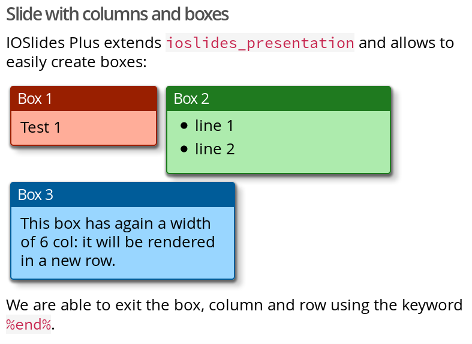

<!-- README.md is generated from README.Rmd. Please edit that file -->
IOSlides Plus
=============

The goal of **iosp** is to extend [ioslides\_presentation](http://rmarkdown.rstudio.com/ioslides_presentation_format.html) mainly using a customized `css`.

The main **features** are:

-   easily create boxes with optional titles in the [bootstrap](http://getbootstrap.com/) fashion using third level headers (`###`)
-   adjust the width and horizontal position (offset) of boxes
-   define custom box background colours
-   specify alignment of adjacent boxes (top / middle / bottom)
-   prettier code highlighting
-   easy footer with hyperlink

Installation
------------

You can install `iosp` from github with:

``` r
# install.packages("devtools")
devtools::install_github("koncina/iosp")
```

Demo template
-------------

In **Rstudio**, create a new `Rmd` &gt; From template &gt; IOSlides Plus

The following `Rmd` code

    ## Slide with columns as boxes

    Just a proof of concept. I changed the original lua file from `ioslides_presentation`.

    ### Box 1{.col-4 .box .bg-red}

    Test 1

    ### Box 2{.col-6 .box .bg-green}

    - line 1
    - line 2

    ### Box 3{.col-6 .box .bg-blue}

    This box has again a width of 6 col: it will be rendered in a new row

    %end%

    We are able to exit the box and row using the keyword `%end%` as suggested [here](https://github.com/koncina/iosp/issues/5).

will produce the output:



Custom colours
--------------

see example with [box\_colour](https://koncina.github.io/iosp/box_colours.html)

Box colours gallery
-------------------

see example with [box\_colour\_gallery](https://koncina.github.io/iosp/box_colours_gallery.html)
